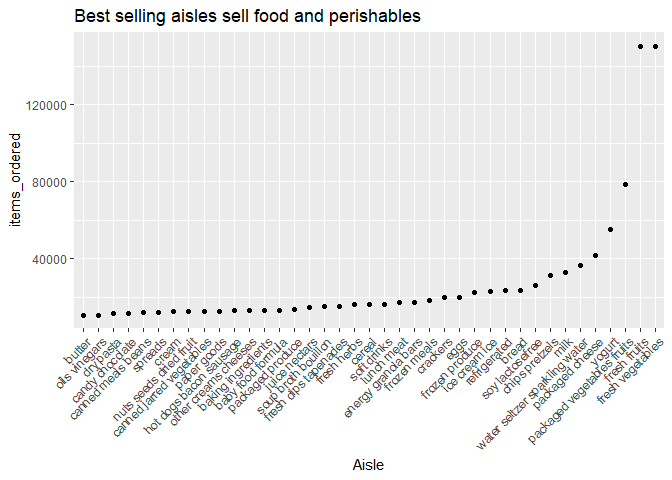
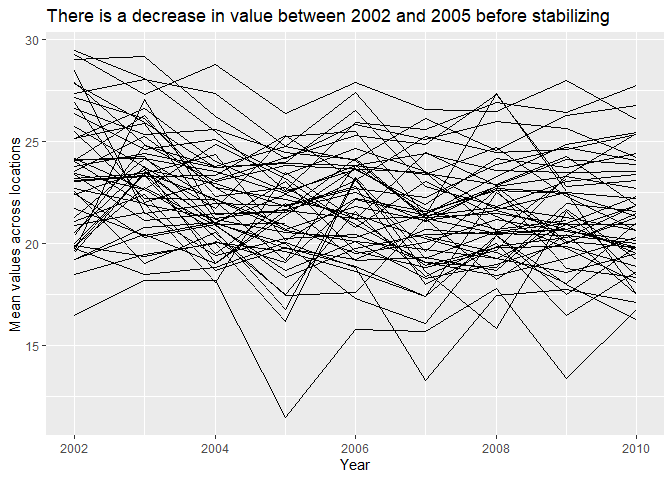
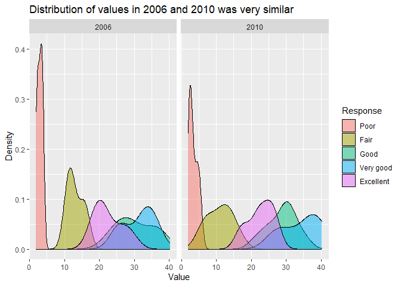
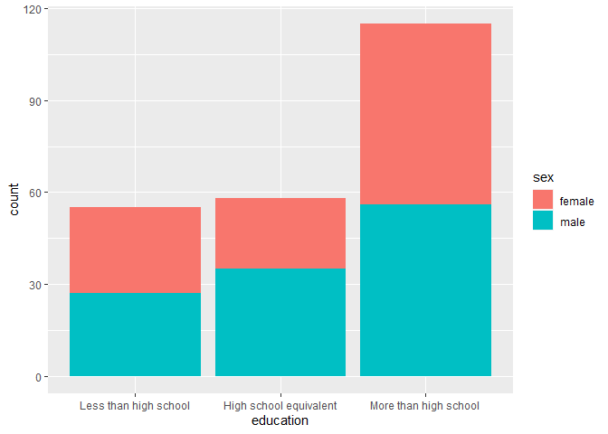
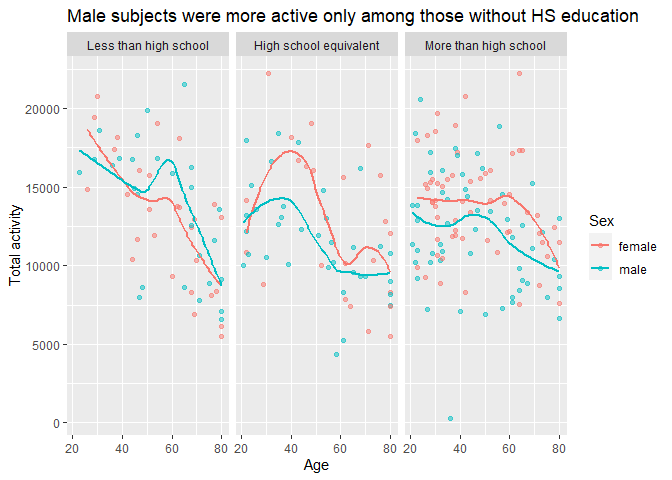
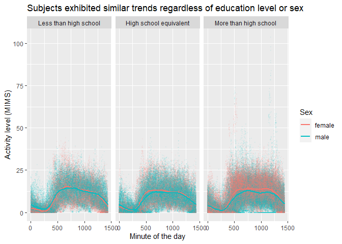

p8105_hw3_geg2145
================
Gustavo Garcia-Franceschini
2023-10-14

# Problem 1

``` r
data("instacart")
```

The goal is to do some exploration of this dataset. To that end, write a
short description of the dataset, noting the size and structure of the
data, describing some key variables, and giving illustrative examples of
observations. Then, do or answer the following (commenting on the
results of each):

How many aisles are there, and which aisles are the most items ordered
from?

``` r
instacart %>%
  group_by(aisle) %>%
  summarize(items_ordered = n()) %>%
  arrange(desc(items_ordered)) %>% 
  head(4)
```

    ## # A tibble: 4 × 2
    ##   aisle                      items_ordered
    ##   <chr>                              <int>
    ## 1 fresh vegetables                  150609
    ## 2 fresh fruits                      150473
    ## 3 packaged vegetables fruits         78493
    ## 4 yogurt                             55240

Make a plot that shows the number of items ordered in each aisle,
limiting this to aisles with more than 10000 items ordered. Arrange
aisles sensibly, and organize your plot so others can read it.

``` r
instacart %>%
  group_by(aisle) %>%
  summarize(items_ordered = n()) %>%
  arrange(desc(items_ordered)) %>%
  filter(items_ordered > 10000) %>%
  mutate(aisle = fct_reorder(aisle, items_ordered)) %>%
  ggplot() + geom_point(aes(x = aisle, y = items_ordered)) +
  theme(axis.text.x = element_text(angle = 45, hjust = 1))
```

<!-- -->

Make a table showing the three most popular items in each of the aisles
“baking ingredients”, “dog food care”, and “packaged vegetables fruits”.
Include the number of times each item is ordered in your table.

``` r
instacart %>%
  filter(aisle == "baking ingredients" | 
         aisle == "dog food care" |
         aisle == "packaged vegetables fruits") %>%
  group_by(aisle, product_name) %>%
  summarize(times_ordered = n()) %>%
  mutate(rank = min_rank(desc(times_ordered))) %>%
  filter(rank <= 3) %>%
  arrange(aisle, rank) %>%
  knitr::kable()
```

    ## `summarise()` has grouped output by 'aisle'. You can override using the
    ## `.groups` argument.

| aisle                      | product_name                                  | times_ordered | rank |
|:---------------------------|:----------------------------------------------|--------------:|-----:|
| baking ingredients         | Light Brown Sugar                             |           499 |    1 |
| baking ingredients         | Pure Baking Soda                              |           387 |    2 |
| baking ingredients         | Cane Sugar                                    |           336 |    3 |
| dog food care              | Snack Sticks Chicken & Rice Recipe Dog Treats |            30 |    1 |
| dog food care              | Organix Chicken & Brown Rice Recipe           |            28 |    2 |
| dog food care              | Small Dog Biscuits                            |            26 |    3 |
| packaged vegetables fruits | Organic Baby Spinach                          |          9784 |    1 |
| packaged vegetables fruits | Organic Raspberries                           |          5546 |    2 |
| packaged vegetables fruits | Organic Blueberries                           |          4966 |    3 |

Make a table showing the mean hour of the day at which Pink Lady Apples
and Coffee Ice Cream are ordered on each day of the week; format this
table for human readers (i.e. produce a 2 x 7 table).

``` r
instacart %>%
  filter(product_name == "Pink Lady Apples" | 
         product_name == "Coffee Ice Cream") %>%
  group_by(product_name, order_dow) %>%
  summarize(mean_hour = mean(order_hour_of_day)) %>%
  pivot_wider(names_from = order_dow, 
              values_from = mean_hour) %>%
  knitr::kable()
```

    ## `summarise()` has grouped output by 'product_name'. You can override using the
    ## `.groups` argument.

| product_name     |        0 |        1 |        2 |        3 |        4 |        5 |        6 |
|:-----------------|---------:|---------:|---------:|---------:|---------:|---------:|---------:|
| Coffee Ice Cream | 13.77419 | 14.31579 | 15.38095 | 15.31818 | 15.21739 | 12.26316 | 13.83333 |
| Pink Lady Apples | 13.44118 | 11.36000 | 11.70213 | 14.25000 | 11.55172 | 12.78431 | 11.93750 |

# Problem 2

``` r
data("brfss_smart2010")
```

First, do some data cleaning:

- format the data to use appropriate variable names;
- focus on the “Overall Health” topic
- include only responses from “Excellent” to “Poor”
- organize responses as a factor taking levels ordered from “Poor” to
  “Excellent”

``` r
brfss_smart2010 = brfss_smart2010 %>%
  janitor::clean_names() %>%
  filter(topic == "Overall Health" &
           !is.na(response)) %>%
  mutate(response = factor(response, levels = c("Poor", "Fair", "Good", 
                                "Very good", "Excellent")))
```

Using this dataset, do or answer the following (commenting on the
results of each):

- In 2002, which states were observed at 7 or more locations? What about
  in 2010?

``` r
brfss_smart2010 %>%
  filter(year == 2002) %>%
  group_by(locationabbr) %>%
  summarize(unique_locations = length(unique(locationdesc))) %>%
  filter(unique_locations >= 7)
```

    ## # A tibble: 6 × 2
    ##   locationabbr unique_locations
    ##   <chr>                   <int>
    ## 1 CT                          7
    ## 2 FL                          7
    ## 3 MA                          8
    ## 4 NC                          7
    ## 5 NJ                          8
    ## 6 PA                         10

``` r
brfss_smart2010 %>%
  filter(year == 2010) %>%
  group_by(locationabbr) %>%
  summarize(unique_locations = length(unique(locationdesc))) %>%
  filter(unique_locations >= 7)
```

    ## # A tibble: 14 × 2
    ##    locationabbr unique_locations
    ##    <chr>                   <int>
    ##  1 CA                         12
    ##  2 CO                          7
    ##  3 FL                         41
    ##  4 MA                          9
    ##  5 MD                         12
    ##  6 NC                         12
    ##  7 NE                         10
    ##  8 NJ                         19
    ##  9 NY                          9
    ## 10 OH                          8
    ## 11 PA                          7
    ## 12 SC                          7
    ## 13 TX                         16
    ## 14 WA                         10

- Construct a dataset that is limited to Excellent responses, and
  contains, year, state, and a variable that averages the data_value
  across locations within a state. Make a “spaghetti” plot of this
  average value over time within a state (that is, make a plot showing a
  line for each state across years – the geom_line geometry and group
  aesthetic will help).

``` r
brfss_smart2010 %>% 
  filter(response == "Excellent") %>%
  group_by(year, locationabbr) %>%
  summarize(mean_value = mean(data_value))  %>%
  arrange(desc(year)) %>%
  ggplot() + geom_line(aes(x = year, y = mean_value,
                            group = locationabbr))
```

    ## `summarise()` has grouped output by 'year'. You can override using the
    ## `.groups` argument.

    ## Warning: Removed 3 rows containing missing values (`geom_line()`).

<!-- -->

- Make a two-panel plot showing, for the years 2006, and 2010,
  distribution of data_value for responses (“Poor” to “Excellent”) among
  locations in NY State.

``` r
brfss_smart2010 %>%
  filter(locationabbr == "NY" & (year == 2006 | year == 2010))  %>%
  mutate(year = factor(year, levels = c("2006", "2010")))  %>%
  ggplot() + geom_density(aes(x = data_value, fill = response), alpha= 0.5) +
  facet_grid( ~ year)
```

<!-- -->

# Problem 3

Load, tidy, merge, and otherwise organize the data sets. Your final
dataset should include all originally observed variables; exclude
participants less than 21 years of age, and those with missing
demographic data; and encode data with reasonable variable classes
(i.e. not numeric, and using factors with the ordering of tables and
plots in mind).

``` r
df_dem = read_csv(file = "./data/nhanes_covar.csv",
                  skip = 4) %>% 
  janitor::clean_names() %>%
  drop_na() %>%
  filter(age > 20) %>%
  mutate(sex = case_when(
    sex == 1 ~ "male",
    sex == 2 ~ "female"),
    education = case_when(
      education == 1 ~ "Less than high school",
      education == 2 ~ "High school equivalent",
      education == 3 ~ "More than high school"
    )) %>%
  mutate(sex = factor(sex),
         education = factor(education, levels = c("Less than high school",
                                                  "High school equivalent",
                                                  "More than high school")))
```

    ## Rows: 250 Columns: 5
    ## ── Column specification ────────────────────────────────────────────────────────
    ## Delimiter: ","
    ## dbl (5): SEQN, sex, age, BMI, education
    ## 
    ## ℹ Use `spec()` to retrieve the full column specification for this data.
    ## ℹ Specify the column types or set `show_col_types = FALSE` to quiet this message.

``` r
df_acc = read_csv(file = "./data/nhanes_accel.csv") %>% 
  janitor::clean_names() %>%
  pivot_longer(min1:min1440, names_to = "minute", values_to = "mims") %>%
  mutate(minute = as.numeric(str_sub(minute, 4, -1)))
```

    ## Rows: 250 Columns: 1441
    ## ── Column specification ────────────────────────────────────────────────────────
    ## Delimiter: ","
    ## dbl (1441): SEQN, min1, min2, min3, min4, min5, min6, min7, min8, min9, min1...
    ## 
    ## ℹ Use `spec()` to retrieve the full column specification for this data.
    ## ℹ Specify the column types or set `show_col_types = FALSE` to quiet this message.

``` r
df_mims = left_join(df_dem, df_acc, by = "seqn")
```

Produce a reader-friendly table for the number of men and women in each
education category, and create a visualization of the age distributions
for men and women in each education category. Comment on these items.

``` r
df_dem %>%
  group_by(sex, education) %>%
  summarize(count = n()) %>%
  knitr::kable()
```

    ## `summarise()` has grouped output by 'sex'. You can override using the `.groups`
    ## argument.

| sex    | education              | count |
|:-------|:-----------------------|------:|
| female | Less than high school  |    28 |
| female | High school equivalent |    23 |
| female | More than high school  |    59 |
| male   | Less than high school  |    27 |
| male   | High school equivalent |    35 |
| male   | More than high school  |    56 |

``` r
df_dem %>%
  ggplot() + geom_bar(aes(x = education, fill = sex))
```

<!-- -->

Traditional analyses of accelerometer data focus on the total activity
over the day. Using your tidied dataset, aggregate across minutes to
create a total activity variable for each participant. Plot these total
activities (y-axis) against age (x-axis); your plot should compare men
to women and have separate panels for each education level. Include a
trend line or a smooth to illustrate differences. Comment on your plot.

``` r
df_mims %>%
  group_by(seqn, education, age, sex) %>%
  summarize(total_activity = sum (mims)) %>%
  ggplot() + geom_point(aes(y = total_activity, x = age, 
                            color = sex), alpha = .5) +
  geom_smooth(aes(y = total_activity, x = age, 
                            color = sex),se = FALSE) +
  facet_grid( ~ education)
```

    ## `summarise()` has grouped output by 'seqn', 'education', 'age'. You can
    ## override using the `.groups` argument.
    ## `geom_smooth()` using method = 'loess' and formula = 'y ~ x'

<!-- -->

Accelerometer data allows the inspection activity over the course of the
day. Make a three-panel plot that shows the 24-hour activity time
courses for each education level and use color to indicate sex. Describe
in words any patterns or conclusions you can make based on this graph;
including smooth trends may help identify differences.

``` r
df_mims %>%
  ggplot() + geom_point(aes(y = mims, x = minute, 
                            color = sex), alpha = .05, size = 0.5)+
  geom_smooth(aes(y = mims, x = minute, 
                            color = sex),se = FALSE) +
  facet_grid( ~ education)
```

    ## `geom_smooth()` using method = 'gam' and formula = 'y ~ s(x, bs = "cs")'

<!-- -->
